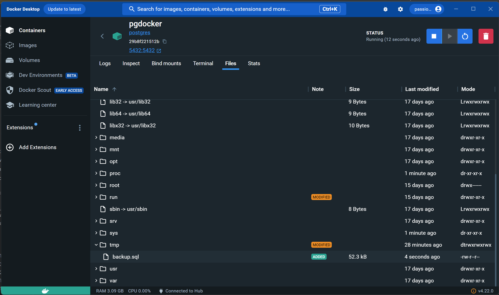

# Отчет по первой лабораторной работе

## Перед началом

Для выполнения этого задания необходимо установить:
- [Docker](https://www.docker.com/products/docker-desktop/)
- [pgAdmin](https://www.pgadmin.org/)


## Задание 0

Для создания сервера Postgresql будет использовать Docker контейнер. Для того чтобы его развернуть, необходимо выполнить следующие шаги:

- Получите образ postgres

    ```shell
    docker pull postgres
    ```

- Запустите контейнер Docker
    ```shell
    docker run --rm --name pgdocker -e POSTGRES_PASSWORD=admin1234 -e POSTGRES_USER=admin -e POSTGRES_DB=surgu -d -p 5432:5432 -v $HOME/docker/volumes/postgres:/var/lib/postgresql/data postgres
    ```
    При необходимости замените значения флагов `POSTGRES_PASSWORD`, `POSTGRES_USER`, `POSTGRES_DB` на пользовательские занчения.


- Подключитесь к созданной базе данных через интерфейс pgAdmin
  

## Задание 1

Спроектируйте логическую модель


    
Спроектируйте физическую модель


Выполните [sql-скрипт](inittables.sql) для создания необходимых таблиц


Убедитесь в успешном создании таблиц


## Задание 2

Просмотрите список параметров базы данных, которые могут быть
установлены; Просмотрите список установленных параметров созданной Вами базы
данных.


Определите использование базы данных только владельцем и в режиме
поддержки одного пользователя. Для этого необходимо отозвать разрешения у всех пользователей и оставить разрешение 
на подключение только пользователю admin.

```sql
REVOKE CONNECT ON DATABASE surgu FROM PUBLIC;
GRANT CONNECT ON DATABASE surgu TO admin;
```

Убедитесь в изменении параметров базы данных.


## Задание 3
Переименуйте созданную Вами базу данных. Для этого в Query Tool выполните следующий запрос:

```sql
ALTER DATABASE surgu RENAME TO storedb;
```

Если получили ошибку `ERROR:  current database cannot be renamed`, то необходимо открыть Query Tool у другой базы данных,
например, postgres. После чего повторить запрос.

Если получили ошибку `ERROR:  database "surgu" is being accessed by other users`, то необходимо принудительно закрыть все
открытые сессии и повторить попытку.

```sql
SELECT pg_terminate_backend(pg_stat_activity.pid)
FROM pg_stat_activity
WHERE datname = 'surgu'AND pid <> pg_backend_pid();
```

После успешного изменения названия базы данных, потребуется поменять настройки подключения.


## Задание 4

Перед выполнением этого задания, предварительно заполните таблицу `category` тестовыми данными:
```sql
CREATE OR REPLACE FUNCTION fill_category() RETURNS void AS $$
DECLARE
    i INTEGER := 0;
BEGIN
    WHILE i < 1000 LOOP -- создаст 1000 записей
        INSERT INTO category (category_name) VALUES ('Category ' || i);
        i := i + 1;
    END LOOP;
END;
$$ LANGUAGE plpgsql;


SELECT fill_category();
```

Далее для своей базы данных установите возможность автоматического сжатия данных.


## Задание 5
Определите сведения о дисковом пространстве, занимаемом таблицей вместе с индексами (714 Мб).
```sql
SELECT pg_size_pretty(pg_total_relation_size('category'));
```

Произведите сжатие базы данных так, чтобы она содержала только 25% пространства, доступного ей на текущий момент.

Для этого в поле «VASCUUM scale factor» указать 0.75(75%)


Чтобы выполнить сжатие данных с выводом аналитики, необходимо выполнить следующую команду:
```sql
VACUUM (VERBOSE, ANALYZE) category;
VACUUM full category;
```

```
INFO:  vacuuming "storedb.public.category"
INFO:  finished vacuuming "storedb.public.category": index scans: 0
pages: 0 removed, 63695 remain, 63695 scanned (100.00% of total)
tuples: 0 removed, 10000000 remain, 0 are dead but not yet removable
removable cutoff: 780, which was 0 XIDs old when operation ended
new relfrozenxid: 780, which is 1 XIDs ahead of previous value
frozen: 0 pages from table (0.00% of total) had 0 tuples frozen
index scan not needed: 0 pages from table (0.00% of total) had 0 dead item identifiers removed
avg read rate: 29.307 MB/s, avg write rate: 29.338 MB/s
buffer usage: 63765 hits, 63632 misses, 63700 dirtied
WAL usage: 63696 records, 2 full page images, 3774676 bytes
system usage: CPU: user: 1.10 s, system: 1.58 s, elapsed: 16.96 s
INFO:  analyzing "public.category"
INFO:  "category": scanned 30000 of 63695 pages, containing 4709870 live rows and 0 dead rows; 30000 rows in sample, 9999839 estimated total rows
VACUUM
```

Проверим еще раз размер таблицы (712 Мб).
```sql
SELECT pg_size_pretty(pg_total_relation_size('category'));
```

## Задание 6

Создайте резервную копию базы данных, для этого выполните следующую команду:

```shell
docker exec -it pgdocker pg_dump -U admin -f /tmp/backup.sql storedb
```

После чего файл дампа [backup.sql](backup.sql) появится в директории tmp контейнера.



## Задание 7

Удалите базу данных.


Восстановите удаленную базу данных. Для этого сначала создайте базу данных `storedb`, после чего запустите восстановление
из файла бэкапа.

```shell
docker exec -it pgdocker psql -U admin -d postgres -c "CREATE DATABASE storedb;"
```

```shell
docker exec -it pgdocker psql -U admin -d storedb -f /tmp/backup.sql
```

Обновите данные в pgAdmin, если восстановление прошло успешно, то уведите ранее добавленные данные.


## Задание 8

Открепите базу данных от сервера.


Прикрепите базу данных к серверу.


Докажите правильность выполненного действия.
