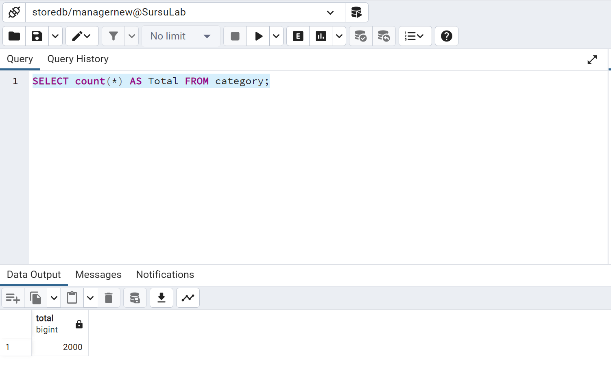

# Отчет по второй лабораторной работе

## Подключение к базе данных

- Запустите контейнер Docker
    ```shell
    docker run --rm --name pgdocker -e POSTGRES_PASSWORD=admin1234 -e POSTGRES_USER=admin -e POSTGRES_DB=surgu -d -p 5432:5432 -v $HOME/docker/volumes/postgres:/var/lib/postgresql/data postgres
    ```
    При необходимости замените значения флагов `POSTGRES_PASSWORD`, `POSTGRES_USER`, `POSTGRES_DB` на пользовательские значения.

- Подключитесь к созданной базе данных через интерфейс pgAdmin.

## Задание 1

Определите всех пользователей, которые могут создавать базы данных (rolcreatedb).

```sql
SELECT rolname FROM pg_roles WHERE rolcreatedb = true;
```

## Задание 2

Определите всех пользователей, которые могут создавать роли (rolcreaterole).

```sql
SELECT rolname FROM pg_roles WHERE rolcreaterole = true;
```

## Задание 3

Создайте пользователя для входа с подключением к вашей базе данных,
докажите правильность выполненных действий. Созданному пользователю
присвойте права на создание и изменение баз данных, докажите правильность
выполненных действий. Подключитесь к MS SQL Server, используя созданную
учетную запись, и создайте еще одну учетную запись пользователя для входа,
результат объясните.

### Шаг 1: Создание пользователя

```sql
CREATE USER user_create_db WITH PASSWORD 'user1';
```

### Шаг 2: Предоставление прав на создание баз данных

```sql
ALTER USER user_create_db CREATEDB;
```

### Шаг 3: Проверка прав пользователя на создание баз данных

```sql
SELECT rolname, rolcreatedb FROM pg_roles WHERE rolname = 'user_create_db';
```

### Шаг 4: Сменить пользователя


### Шаг 5: Создать нового пользователя

```sql
CREATE USER user_error WITH PASSWORD 'user2';
```

Операция завершилась с ошибкой, так как у `user_create_db` нет прав на создание новых учетных записей.
```
ERROR:  Only roles with the CREATEROLE attribute may create roles.permission denied to create role 

ERROR:  permission denied to create role
SQL state: 42501
Detail: Only roles with the CREATEROLE attribute may create roles.
```

## Задание 4

Для созданного пользователя измените пароль.

```sql
ALTER USER user_create_db WITH PASSWORD 'password_new';
```

## Задание 5

Создайте пользователя Admin и присвойте ему роль, обладающую
полным доступом к базе данных.

### Шаг 1: Сменить учетную запись


### Шаг 2: Создать нового пользователя

```sql
CREATE USER AdminNew WITH PASSWORD 'admin1234';
```

### Шаг 3: Создание роли с полным доступом

```sql
CREATE ROLE full_access;
GRANT ALL PRIVILEGES ON ALL TABLES IN SCHEMA public TO full_access;
GRANT ALL PRIVILEGES ON ALL SEQUENCES IN SCHEMA public TO full_access;
GRANT ALL PRIVILEGES ON ALL FUNCTIONS IN SCHEMA public TO full_access;
```

### Шаг 4: Присвоение роли пользователю

```sql
GRANT full_access TO AdminNew;
```

## Задание 6

### Шаг 1: Создать нового пользователя

```sql
CREATE USER UserNew WITH PASSWORD 'user1234';
```

### Шаг 2: Создание роли с доступом к просмотру только схем

```sql
CREATE ROLE schema_viewer;
GRANT USAGE ON SCHEMA public TO schema_viewer;
GRANT SELECT ON ALL TABLES IN SCHEMA public TO schema_viewer;
REVOKE SELECT ON ALL TABLES IN SCHEMA public FROM schema_viewer;
```

### Шаг 3: Присвоение роли пользователю

```sql
GRANT schema_viewer TO UserNew;
```

### Шаг 4: Смена учетной записи и попытка выполнения запросов
-[ ] Не понятно, что хотят

## Задание 7

Пользователю manager присвойте роль, обладающую только
возможностью просмотра содержимого вашей базы данных

### Шаг 1: Создать нового пользователя

```sql
CREATE USER ManagerNew WITH PASSWORD 'manager1234';
```

### Шаг 2: Создание роли с доступом к просмотру только схем

```sql
CREATE ROLE read_only;
GRANT USAGE ON SCHEMA public TO read_only;
GRANT SELECT ON ALL TABLES IN SCHEMA public TO read_only;
ALTER DEFAULT PRIVILEGES IN SCHEMA public GRANT SELECT ON TABLES TO read_only;
```

### Шаг 3: Присвоение роли пользователю

```sql
GRANT read_only TO ManagerNew;
```

### Шаг 4: Смена роли, выполнение запросов


```sql
SELECT count(*) AS Total FROM category;
```



```sql
INSERT INTO category (parent_category, category_name) VALUES (200, 'TestCategory');
```


## Задание 8

Пользователю manager запретите просмотр данных БД, присвоив необходимую роль. Как доказать правильность внесенных изменений?

### Шаг 1: Отзыв роли у ManagerNew

```sql
REVOKE read_only FROM ManagerNew;
```

### Шаг 2: Выполнение запроса

```sql
SELECT count(*) AS Total FROM category;
```

